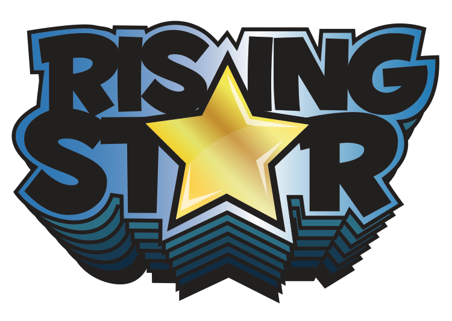

# Rising Star 2018

## Description
The following repo is home to the project I was working on for the Grads in
Games: Rising Star 2018 competition. Entrants were tasked with taking a base
prototype project from start to completion over the course of a few months. Now
that the competition is over, I feel the need to let other people see how I went
about this task.

While this this project wasn't enough to make me a finalist, I did have a lot of
fun making it, and hopefully someone else can learn something, or perhaps
attempt to recreate the conditions of the test and do better than I did.

The game itself is my second attempt at a freeform, laid back fishing game, this
time in the third dimension.

## Credits
While I wrote most of the code, I have to give a shout-out to
[Brian Cox](http://www.briancox.be) (not that one) and Dan Dudley, who worked on
the project prototype that made the basis for the competition, as well as
[Kenney](https://kenney.nl/) who's art assets are included under a Creative
Commons Zero (CC0) license.

And that's about it. I might come back to this project at some point, but for
now, you can play what I have so far over on
[Itch](https://seajay.itch.io/project-double-star).
